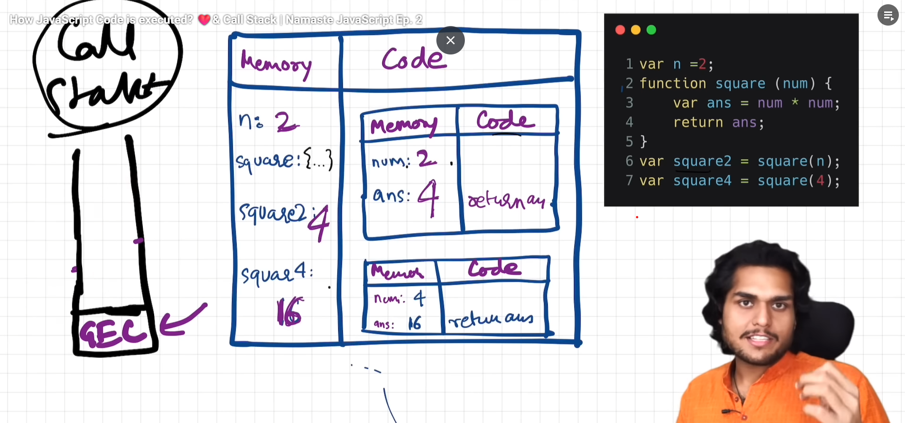

When the code execution starts, JavaScript creates a **Global Execution Context** which is pushed to a **Call Stack**.  

**Call Stack**  
1. It manages the order of execution of execution contexts.
2. It performs push and pop on execution context as execution is completed
3. It is also known as **Execution Context Stack**, **Program Stack**, **Control Stack**, **Runtime Stack**, **Machine Stack**.
 

The code is executed in two phases:  
1. **Memory Creation**
2. **Code Execution**

## Memory Creation

**Step 1**: In this phase, we allocate memory to all the variables and functions after going through the code line by line.  
   1. We allocate the variable with the **undefined** value in this phase
   2. Similarly, we store the function code with function name (key-value pair) while allocating the memory to functions.

## Code Execution

**Step 2**: In this phase, code is executed line by line.  
1. When a function is invoked, the function creates it's own execution context inside the global execution context and it's execution context is pushed to **Call Stack**. 
   1. It also execute the code in two phases which are mentioned above. (**Memory Creation**, **Code Execution**)
2. The function execution context is deleted and pop out of the **Call Stack** when function execution is completed.
   1. When function encounters return keyword, it returns the control to the global execution context or from where the function was invoked.
3. When the program executed, the global execution context is deleted and pop out of call stack. 

 

