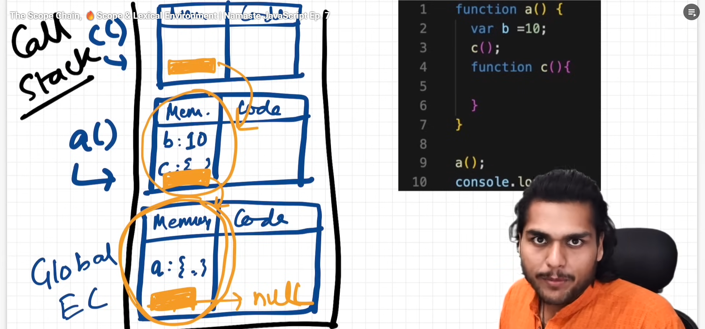

Whenever execution context is created, lexical enviornment is also created. 

# Lexical Environment
**Definition** -> It includes local memory and the lexical environment of it's parent.

1. **Scope** refers to where we can access the variable or function in the program.

2. **Scope chain** refers to going to lexical environment of it's parent until we find the variable value or encounters null. 

3. The **lexical enviroment** of **Global Execution Context** is ***null**.*


```
function outer() {
  var a = 10;
  function inner() {
    console.log(a); // Found via scope chain
    console.log(b); // It will give **(not defined)** error because it is not defined in the program.
  }
  inner();
}
outer();

// Scope chain: inner → outer → global → null
```
